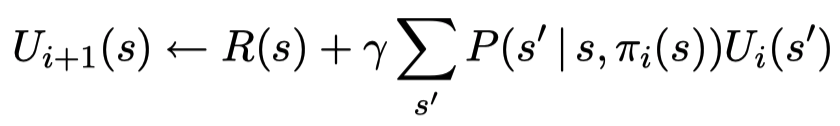

# Markov Decision Process

A Markov decision process (MDP), by definition, is a sequential decision problem for a fully observable, stochastic environment with a Markovian transition model and additive rewards. It consists of a set of states, a set of actions, a transition model, and a reward function. Here's an example. 


This is a simple 4 x 3 environment, and each block represents a state. The agent can move left, right, up, or down from a state. The "intended" outcome occurs with probability 0.8, but with probability 0.2 the agent moves at right angles to the intended direction. A collision with the wall or boundary results in no movement. The two terminal states have reward +1 and -1, respectively, and all other states have a constant reward (e.g. of -0.01). 

Also, a MDP usually has a discount factor γ , a number between 0 and 1, that describes the preference of an agent for current rewards over future rewards. 

## Policy

A solution to a MDP is called a policy π(s). It specifies an action for each state s. In a MDP, we aim to find the optimal policy that yields the highest expected utility. Here's an example of a policy. 


## Value Iteration
Value iteration is an algorithm that gives an optimal policy for a MDP. It calculates the utility of each state, which is defined as the expected sum of discounted rewards from that state onward.


This is called the Bellman equation. For example, the utility of the state (1, 1) in the MDP example shown above is: 


For n states, there are n Bellman equations with n unknowns (the utilities of states). To solve this system of equations, value iteration uses an iterative approach that repeatedly updates the utility of each state (starting from zero) until an equilibrium is reached (converge). The iteration step, called a Bellman update, looks like this:


Here's the pseudocode for calculating the utilities of states. 


Then, after the utilities of states are calculated, we can use them to select an optimal action for each state.


```valueIteration.py``` contains the Python implementation of this algorithm for the MDP example shown above. 

## (Modified) Policy Iteration

Policy iteration is another algorithm that solves MDPs. It alternates the following two steps, starting with a random policy, until the policy improvement step yields no change:

(1) Policy evaluation: given a policy, calculate the utility of each state U(s) if the policy is executed; 

(2) Policy improvement: update the policy based on U(s).


For the policy evaluation step, we use a simplified version of the Bellman equation to calculate the utility of each state. 


For n states, there are n linear equations with n unknowns (the utilities of states), which can be solved in O(n^3) time. To make the algorithm more efficient, we can perform some simplified Bellman updates (simplified because the policy is fixed) to get an approximation of the utilities instead of calculating the exact solutions. 



Here's the pseudocode for policy iteration. 

<policy_iteration.png>

```policyIteration.py``` contains the Python implementation of this algorithm for the MDP example shown above. 

### Reference
Stuart Russell and Peter Norvig. Artificial Intelligence: A Modern Approach (3rd ed.).
